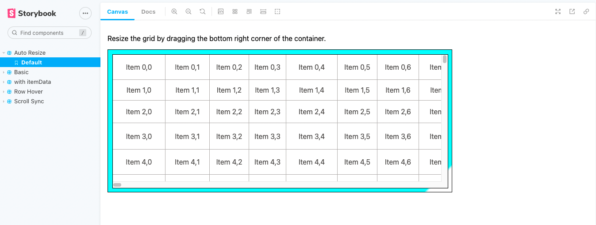

# react-window Playtround

Examples of [react-window](https://github.com/bvaughn/react-window).



## Usage

Currently, this repository only contains Storybook.

```bash
$ yarn
$ yarn storybook
```

All components are placed in [components](./components) directory.

## For Japanese

see: [react-window でこんなことできる？のまとめ](https://zenn.dev/zaki_yama/articles/react-window-tips)
